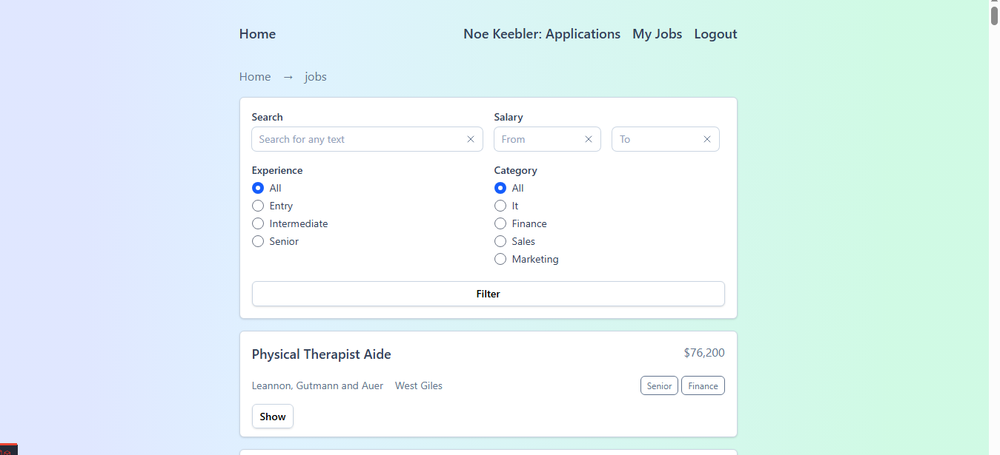

# Job Board Application  

A professional job board web application built with **Laravel 12**, **MySQL**, **Vite**, and **Tailwind CSS 4**.  
It allows users to browse jobs, apply with CVs, and for employers to post and manage job listings with strict access control and clean component-based UI.  
---

# Demo: https://jobboard.elabyad.online

---

## ✨ Features  

### Authentication  
- User Registration & Login.  
- Guests can browse jobs but need to log in to apply or create jobs.  

### Jobs  
- Browse jobs (public).  
- Jobs include: title, location, salary, experience level (Entry/Intermediate/Senior), category (Marketing, Sales, Finance).  
- Soft deletes: deleted jobs are marked with a red "Deleted" badge.  
- Policies:  
  - Only the employer who created a job can delete it.  
  - Jobs with applications cannot be edited.  

### Applications  
- Users can apply to jobs with expected salary & CV upload.  
- A user cannot apply more than once to the same job.  
- Applicants can manage (view, delete) their own applications.  

### Employers  
- A user can create an **Employer profile** (only once).  
- Employers can create, edit, and delete their own jobs.  
- Employers can see applications submitted to their jobs.  
- Middleware `employer` ensures only employers can manage jobs and applications.  

---

## 🧑‍💻 User Roles  

- **Guest** → Browse jobs only.  
- **User** → Apply to jobs, manage own applications.  
- **Employer** → Post jobs, manage own jobs & related applications.  

---

## 🛠️ Tech Stack  

- **Backend:** Laravel 12 (PHP 8.2+)  
- **Frontend:** Tailwind CSS 4 + Vite  
- **Forms:** `@tailwindcss/forms`  
- **Debugging:** `barryvdh/laravel-debugbar`  
- **Database:** MySQL 8+  

---

## 📦 Requirements  

- PHP 8.2+  
- Composer 2+  
- Node.js 20+  
- NPM 9+  
- MySQL 8+  

---

## 📂 Project Structure  

### Controllers  
- `JobController` → Browse jobs  
- `ApplicationController` → Apply to jobs  
- `MyApplicationController` → Manage user applications  
- `EmployerController` → Create employer profile  
- `MyJobController` → Manage employer’s jobs & applications  
- `Auth Controllers` → Login & Register  

### Components (Blade)  
- `breadcrumbs`, `button`, `card`, `job-card`, `label`, `layout`, `link-button`, `radio-group`, `tag`, `text-input`  

### Views  
- Auth: `login`, `register`  
- Employer: `create`  
- Job: `index`, `show`, `create`, `edit`  
- Applications: `create`, `index`  

---

## 📊 Database & Models  

- **Job** → stored in table `offered_jobs`  
  - belongs to Employer  
  - has many JobApplications  

- **Employer**  
  - belongs to User  
  - has many Jobs  

- **JobApplication**  
  - belongs to User and Job  

### Migrations  
- `add_cv_path_to_job_applications_table`  
- `add_soft_deletes_to_offered_jobs_table`  

---

## 🔑 Authorization  

- **Job Policy** → Only creator can delete; no edits if applications exist.  
- **Employer Policy** → User can create employer profile only once.  
- **Middleware `employer`** → Restricts job & application management to job owners.  

---

## 🧪 Seeder  

- 300 Users  
- 20 Employers (linked to users)  
- 100 Jobs created by employers  
- Remaining 280 users create between 0–4 applications per job  

---

## 🛠️ Installation Guide  

### 1. Clone the Repository  
bash:
git clone https://github.com/mohamed-elabyad/job-board.git
cd job-board

### 2. Install Dependencies:
composer install
npm install

---

### 3. Environment Setup:
Copy .env.example to .env and update database credentials:
&& cp .env.example .env 

&& Generate application key:
&& php artisan key:generate

### 4. Database Setup

Run migrations and seeders:
php artisan migrate --seed

This will create:

300 users

20 employers

100 jobs

Applications (0–4 per job)

### 5. Build Frontend Assets
npm install
npm run build

For development:
npm run dev

### 6. Run the Application
php artisan serve

Now open http://localhost:8000

---

## 📸 Screenshots:

---

## 📜 License

This project is licensed under the MIT License.

---

## 👤 Author:
Made with Love ❤️ by Mohamed Elabyad
If you have any questions or want to get in touch, feel free to reach out: 📧 Email: m.elabyad.work@gmail.com
